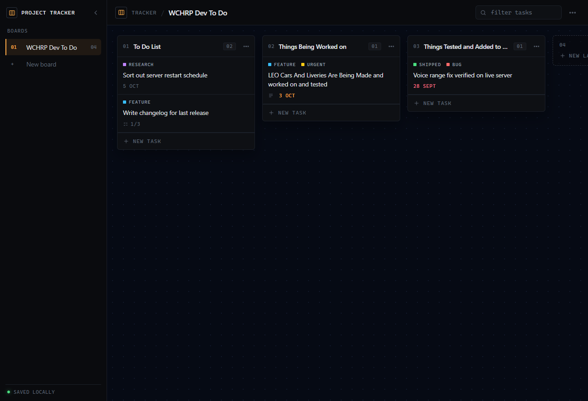

# Project Tracker

A lightweight, local-first board for tracking where a project is at and what is left to do.

No account, no server, no sync — your data lives in your browser. Open it, drag work across
lanes, close it. It is built to be forked and adapted for your own projects.



## Why

Most kanban tools are heavy, account-gated, or full of features you will never touch. This is a
small, readable codebase you can actually understand end to end, then bend into whatever your
team needs — a release checklist, a homework tracker, a game-mod TODO list.

## Features

- **Boards** — separate boards per project, switchable from the sidebar
- **Lanes** — the stages your work moves through (`To Do`, `In Progress`, `Done`, …)
- **Tasks** — with notes, labels, due dates and subtasks
- **Drag and drop** — move tasks between lanes and reorder them; drag lanes too
- **Filter** — live search across task titles, notes and label names
- **Labels** — rename them, recolour them, add your own (per board)
- **Backdrops** — eight near-black tints with a dot-grid workspace
- **Local persistence** — everything is written to `localStorage` as you work
- **Keyboard accessible** — tasks and lanes can be picked up and moved with the keyboard
- **Zero backend** — static build, deploy anywhere

## Getting started

Requires [Node.js](https://nodejs.org) 20.19 or newer (Vite's supported range).

```bash
npm install
npm run dev
```

Then open the printed URL (defaults to `http://localhost:5173`).

| Script          | What it does                      |
| --------------- | --------------------------------- |
| `npm run dev`   | Start the dev server with HMR     |
| `npm run build` | Production build into `dist/`     |
| `npm run preview` | Serve the production build locally |

## Deploying

`npm run build` produces a static `dist/` folder. Drop it on GitHub Pages, Netlify, Vercel, a
plain web server — anything that can serve static files. No environment variables, no build-time
secrets.

## Project structure

```
src/
  main.jsx               Entry point, mounts the store provider
  App.jsx                Shell: sidebar, top bar, modals
  store.jsx              State, reducer actions and localStorage persistence
  styles.css             The entire design system
  components/
    BoardView.jsx        Drag layer, lane layout, drop resolution
    Lane.jsx             A single lane: header, tasks, composer
    TaskRow.jsx          A draggable task row
    TaskModal.jsx        Task detail editor
    BoardConfig.jsx      Board settings (name, backdrop, labels)
    Sidebar.jsx          Board switcher
    Icon.jsx             Inline SVG icon set
```

### How drag and drop works

[dnD-kit](https://dndkit.com) powers the interactions. `BoardView` owns one `DndContext` for the
whole board and uses custom collision detection (`taskFirst`) so that a task dropped in the gap
between two rows resolves to the task it looks like it is landing on, rather than the lane
underneath it. Lanes use their header as the drag handle so tasks stay clickable.

### State shape

Everything lives in one plain object and is serialised as-is:

```js
{
  activeBoardId,
  boards: [{
    id, name, tint,
    labels: [{ id, name, color }],
    lanes:  [{ id, title, tasks: [task] }],
  }],
}

task = { id, title, description, labelIds, dueDate, checklist: [{id, text, done}] }
```

Bumping `STORAGE_KEY` in `src/store.jsx` is the migration strategy: it reseeds rather than
loading a shape it does not understand.

## Customising

- **Colours** — the palette lives in the `:root` block at the top of `src/styles.css`.
  `--accent` drives focus rings, hover markers and primary buttons.
- **Backdrops** — edit `BOARD_TINTS` in `src/store.jsx`.
- **Default labels** — edit `DEFAULT_LABELS` in `src/store.jsx`.
- **Demo content** — `seedState()` in `src/store.jsx` is what a brand-new user sees.

## Contributing

Issues and pull requests are welcome. If you are changing behaviour, please open an issue first
so we can agree on the direction.

## License

[MIT](LICENSE)
